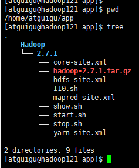
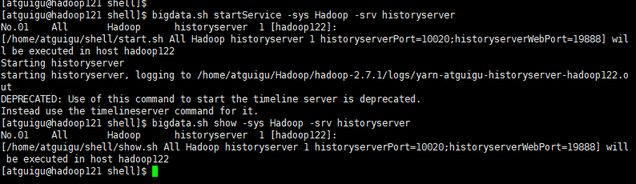

# 大数据集群组件运维平台

由shell等脚本语言编写的控制台，用以控制大数据相关系统的发布、启停等操作。

## Features

- 命令行方式管理大数据集群相关组件
- 统一的管理方式管控主流组件
- 高度、精细化自定义支持

## 支持的大数据组件及基础服务版本

此套脚本在以下版本和环境下经过测试：
- Kylin Linux Advanced Server release V10 (SP3) /(Lance)-aarch64-Build20/20221125
- java version "1.8.0_391" ARM64
- Hadoop 2.7.1
- Zookeeper 3.5.7
- Hive 3.1.2
- mysql-8.4.0-linux-glibc2.28-aarch64.tar

## Supported

-[ ] Hadoop
-[ ] Zookeeper


## Agenda
- [ ]  支持MySQL发布、启动、停止、初始化
- [ ] 支持hive发布、启动、停止
- [ ] 支持Flume发布、启动、停止
- [ ] 支持Kafka发布、启动、停止
- [ ] 支持发布Scala运行环境
- [ ] 支持Spark集群模式发布、启动、停止
- [ ] 支持Redis发布、启动、停止
- [ ] 支持ElasticSearch发布、启动、停止
- [ ] 支持HBase发布、启动、停止
- [ ] 支持SparkStreaming发布、启动、停止
- [ ] 支持Flink集群模式发布、启动、停止
- [ ] 支持GreenPlum发布、启动、停止、初始化
- [ ] 支持Clickhouse发布、启动、停止
- [ ] 编写组件打包规范，增加I脚本编写说明
- [ ] 支持启动前、启动后、停止前、停止后、show前、show后自定义脚本调用，增加脚本编写规范
- [ ] 增加sh.cfg, service.list配置文件配置说明
- [ ] show 高亮区别显示是否正常运行或离线运行
- [ ] 修改自定义show.sh start.sh stop.sh 脚本规范、返回规范
- [ ] 支持show显示相关端口
- [ ] 支持Java Web类、Python Web、Nginx类应用发布、启动、停止

## How to use

1. 准备机器
2. 操作系统配置
3. 控制台准备
4. 构建基础环境
5. 发布应用
6. 启动、停止、显示应用状态

## Example

### 准备机器
集群规划参见“BigData服务器集群规划.xlsx”


root用户登录到6台服务器

- 创建atguigu用户，并设置密码
- 建立console到5台集群节点机atguigu用户的信任
- 建立5台集群节点机atguigu用户相互之间的信任

### 系统配置

1. 配置atguigu用户免密sudo执行命令

```shell
# root用户下执行，以下命令在所有机器均执行一遍
visudo
# 在root ALL=(ALL) NOPASSWD: ALL 这一行下面增加
atguigu	ALL=(ALL) 	NOPASSWD: ALL
# 把下面这行前面的#删除
%wheel  ALL=(ALL)       NOPASSWD: ALL
# 保存退出
# 切换到atguigu用户下进行验证
sudo ls -l /
```
2. 在控制台机器安装ansible
```shell
# atguigu用户登录到控制台服务器
# 安装ansible
sudo yum install -y ansible

# 配置ansible
sudo vi /etc/ansible/hosts
# 在文件末尾配置内容如下
[Hadoop]
hadoop122
hadoop123
hadoop124
hadoop125
hadoop126

# 检查ansible配置成功
ansible all -m ping
```

### 准备控制台

#### 环境变量

- atguigu用户登录控制台，修改~/.bash_profile，增加

```shell
vi ~/.bash_profile

# 添加
SHELLPATH=$HOME/shell
PATH=.:$PATH:$HOME/bin:$SHELLPATH:$SHELLPATH/console
export PATH
export SHELLPATH
sh ~/prepareEnv.sh

# 添加后执行
source  ~/.bash_profile
```

#### 控制台脚本

- 将shell目录整体拷贝到控制台的~目录之下

```shell
dos2unix ~/shell/*.* ~/shell/console/*.*
chmod +x ~/shell/*.sh 
chmod +x ~/shell/console/*.sh
```

#### 控制台配置文件

- 配置~/shell/console/service.list。假设当前需要部署Hadoop和Zookeeper服务。则配置如下：

```
##Center  System   Service    ServiceNo    IP      Args
All       Hadoop   NameNode	      1     hadoop122
All       Hadoop   DataNode	      1     hadoop122
All       Hadoop   NodeManager	  1     hadoop122
All       Hadoop   historyserver  1     hadoop122
All       Hadoop   DataNode	       2     hadoop123
All       Hadoop   ResourceManager 1     hadoop123
All       Hadoop   NodeManager     2     hadoop123
All       Hadoop   SecondaryNameNode   1     hadoop124
All       Hadoop   DataNode            3     hadoop124
All       Hadoop   NodeManager         3     hadoop124
All       Hadoop   DataNode            4     hadoop125
All       Hadoop   NodeManager         4     hadoop125
All       Hadoop   DataNode            5     hadoop126
All       Hadoop   NodeManager         5     hadoop126
All       Zookeeper   Zookeeper	      1     hadoop122
All       Zookeeper	  Zookeeper       2     hadoop123
All       Zookeeper   Zookeeper       3     hadoop124
All       Zookeeper   Zookeeper       4     hadoop125
All       Zookeeper   Zookeeper       5     hadoop126
```

- 配置sh.cfg

```
[ConfigFile]
SHELLPATH=$HOME/shell
ServiceListFile=$SHELLPATH/console/service.list
LocalRuntimeEnvDir=$HOME/run
LoacalAppDir=$HOME/app

[Bigdata]
# 配置组件的版本信息
JAVA_HOME=$HOME/jdk1.8.0_391
Hadoop_Version=2.7.1
HADOOP_Java=jdk1.8.0_391
Zookeeper_Version=3.5.7
Zookeeper_Java=jdk1.8.0_391
```

#### 基础环境

- 准备基础环境

将JDK等基础软件服务，都放置在~/run/之下

```shell
mkdir ~/run/
```

公共Jar包（Todo）

#### 大数据组件发布文件

- 准备发布包

将指定系统和版本的所有发布物，都放置在路径~/app/{系统名}/{版本号}/之下，比如：

| 发布物                   | 是否必须 | 入参                        | 备注                       |
| ------------------------ | -------- | --------------------------- | -------------------------- |
| 压缩包/目录              | 是       | -                           | 发布执行程序等             |
| I脚本                    | 是       | $Ctr $Sys $Srv $SrvNo $Args | copyApp过程中调用          |
| S脚本                    | 否       | $Ctr $Sys $Srv $SrvNo $Args | startService调用           |
| K脚本                    | 否       | $Ctr $Sys $Srv $SrvNo $Args | stopService调用            |
| start.sh/stop.sh/show.sh | 是       | $Ctr $Sys $Srv $SrvNo $Args | 启动、停止、show的时候调用 |

例如Hadoop（假设要部署的版本号为2.7.1）：

```shell
mkdir -p ~/app/Hadoop/2.7.1
```

将Hadoop安装包、脚本、配置文件等上传到该目录下



### 构建基础环境、发布应用、启动应用

登录atguigu@console，执行：

```
# 这两个命令能够为指定系统准备JDK环境
bigdata.sh makeBase -ctr All -sys Hadoop
bigdata.sh makeBase -ctr All -sys Zookeeper

# 这两个命令能够为指定系统准备运行目录
bigdata.sh createService -ctr All -sys Hadoop
bigdata.sh createService -ctr All -sys Zookeeper

# 这两个命令能够将指定系统发布到节点机，并调用I脚本，完成解压
bigdata.sh copyApp -ctr All -sys Hadoop
bigdata.sh copyApp -ctr All -sys Zookeeper

# hadoop集群格式化
bigdata.sh run -ctr All -sys Hadoop -srv NameNode -srvno 1 -cmd 'hdfs namenode -format'

# 执行系统启动
bigdata.sh startService -ctr All -sys Hadoop -srv NameNode -srvno 1
bigdata.sh startService -ctr All -sys Hadoop -srv SecondaryNameNode -srvno 1
bigdata.sh startService -ctr All -sys Hadoop -srv DataNode -srvno 1
bigdata.sh startService -ctr All -sys Hadoop -srv DataNode -srvno 2
bigdata.sh startService -ctr All -sys Hadoop -srv DataNode -srvno 3
bigdata.sh startService -ctr All -sys Hadoop -srv ResourceManager -srvno 1
bigdata.sh startService -ctr All -sys Hadoop -srv NodeManager -srvno 1
bigdata.sh startService -ctr All -sys Hadoop -srv NodeManager -srvno 2
bigdata.sh startService -ctr All -sys Hadoop -srv NodeManager -srvno 3
bigdata.sh startService -ctr All -sys Hadoop -srv historyserver -srvno 1

bigdata.sh startService -ctr All -sys Zookeeper -srv Zookeeper -srvno 1
bigdata.sh startService -ctr All -sys Zookeeper -srv Zookeeper -srvno 2
bigdata.sh startService -ctr All -sys Zookeeper -srv Zookeeper -srvno 3
bigdata.sh startService -ctr All -sys Zookeeper -srv Zookeeper -srvno 4
bigdata.sh startService -ctr All -sys Zookeeper -srv Zookeeper -srvno 5

# 如果需要查看状态、停止，仅需将startService替换为show、stopService
```

## Q&A

### 配置时钟同步
```shell
# 注意：（1）以下命令均需要在root用户下执行，（2）主服务器与其他服务器需要能双向ping通，即网络要通，否则无法同步成功

# 所有服务器安装chrony服务
yum install chrony -y

# 用于其他服务器锚定的主服务器校准时间（源服务器）
sudo date -s "2022-01-01 12:00:00"

# 主服务器（服务端）配置chrony.conf
vi /etc/chrony.conf
在 # Allow NTP Client access from local network. 下面添加
allow all

#  其他服务器（客户端）配置chrony.conf
vi /etc/chrony.conf
将 #Use public servers from the pool.ntp.org project. 下面的替换为
server 主服务器IP ibusrt
将 #Serve time even if not synchronized to any NTP server.注释打开
local stratum 10

# 重启服务端+客户端的chronyd服务（重启之后会自动与服务端同步时间）
service chronyd status
service chronyd restart
service chronyd status

# 让客户端立即时钟同步
chronyc sources -v

# 查看服务端和客户端时间是否一致
date
```
### historyserver启动失败
现象

检查日志文件
```shell
cat /home/atguigu/Hadoop/hadoop-2.7.1/logs/yarn-atguigu-historyserver-hadoop122.log
```


原因
todo

解决方案
todo

### 常见文件copy命令

1. cp - 默认会覆盖同名文件
```shell
[atguigu@hadoop125 test]$ cat a.txt 
bb
[atguigu@hadoop125 test]$ cat data/a.txt
aa
[atguigu@hadoop125 test]$ cp data/a.txt .
[atguigu@hadoop125 test]$ cat a.txt 
aa
[atguigu@hadoop125 test]$

# 相关选项
-f, --force                  如果有已存在的目标文件且无法打开，则将其删除并重试
                                 （该选项在与 -n 选项同时使用时将被忽略）
-i, --interactive            覆盖前询问（使前面的 -n 选项失效）
-R, -r, --recursive		递归复制目录及其子目录内的所有内容
```

2. tar - 解压时默认覆盖同名文件
```shell
[atguigu@hadoop125 test]$ cat a.txt 
aa
[atguigu@hadoop125 test]$ tar -czvf a.tgz a.txt
a.txt
[atguigu@hadoop125 test]$ ls
a  a.tgz  a.txt  data
[atguigu@hadoop125 test]$ echo "" > a.txt 
[atguigu@hadoop125 test]$ cat a.txt

[atguigu@hadoop125 test]$ tar -xzvf a.tgz -C .
a.txt
[atguigu@hadoop125 test]$ cat a.txt 
aa
[atguigu@hadoop125 test]$ 
```

3. scp - 默认会覆盖同名文件
4. rz - 默认不会覆盖同名文件

### KVM创建虚拟机
参见文档（建议使用Typora打开）：
[Linux服务器上创建Linux虚拟机步骤.md](Linux%B7%FE%CE%F1%C6%F7%C9%CF%B4%B4%BD%A8Linux%D0%E9%C4%E2%BB%FA%B2%BD%D6%E8.md)