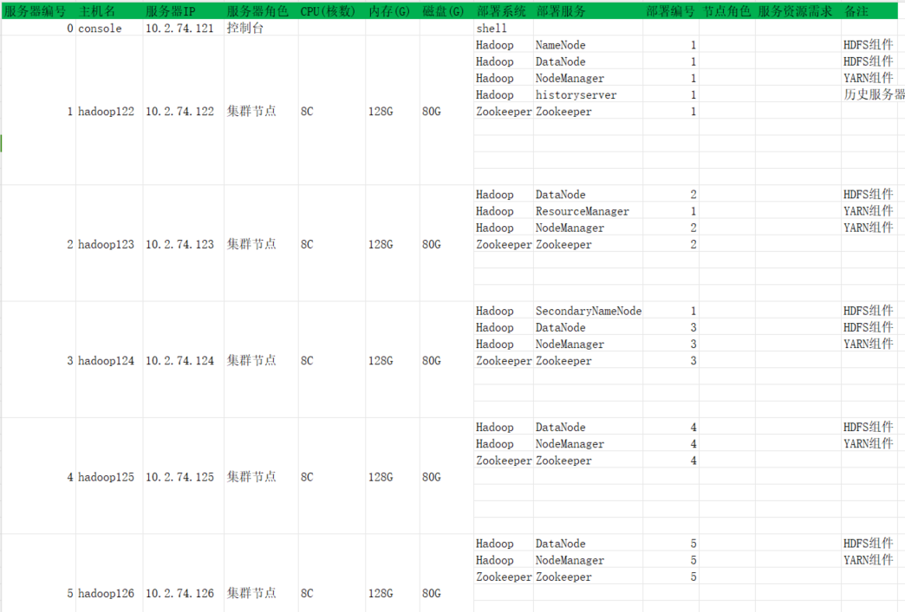

# 大数据集群构建步骤

本文件夹是由shell等脚本语言编写的控制台，用以控制大数据相关系统的发布、启停等操作。

使用方式：

1. 将shell文件夹放到~
2. 将profile.d目录下的脚本放到/etc/profile.d/
3. 对脚本进行dos2unix和chmod
4. 在~/.bash_profile增加`export PATH=~/shell/:$PATH`
5. 集群规划参见“BigData服务器集群规划.xlsx”


## 准备机器



root用户登录到6台服务器

- 创建atguigu用户，并设置密码
- 建立console到5台集群节点机atguigu用户的信任
- 建立5台集群节点机atguigu用户相互之间的信任

## 准备控制台

### 环境变量

- atguigu用户登录控制台，修改~/.bash_profile，增加

```shell
vi ~/.bash_profile

# 添加
SHELLPATH=$HOME/shell
PATH=.:$PATH:$HOME/bin:$SHELLPATH:$SHELLPATH/console
export PATH

# 添加后执行
source  ~/.bash_profile
```

### 控制台脚本

- 将shell目录整体拷贝到控制台的~目录之下

dos2unix ~/shell/* ~/shell/console/*

chmod +x ~/shell/* ~/shell/console/*

### 控制台配置文件

- 配置~/shell/console/service.list。假设当前需要部署Hadoop和Zookeeper服务。则配置如下：

```
##Center  System   Service    ServiceNo    IP      Args
All       Hadoop   NameNode	      1     hadoop122
All       Hadoop   DataNode	      1     hadoop122
All       Hadoop   NodeManager	  1     hadoop122
All       Hadoop   historyserver  1     hadoop122
All       Hadoop   DataNode	       2     hadoop123
All       Hadoop   ResourceManager 1     hadoop123
All       Hadoop   NodeManager     2     hadoop123
All       Hadoop   SecondaryNameNode   1     hadoop124
All       Hadoop   DataNode            3     hadoop124
All       Hadoop   NodeManager         3     hadoop124
All       Hadoop   DataNode            4     hadoop125
All       Hadoop   NodeManager         4     hadoop125
All       Hadoop   DataNode            5     hadoop126
All       Hadoop   NodeManager         5     hadoop126
All       Zookeeper   Zookeeper	      1     hadoop122
All       Zookeeper	  Zookeeper       2     hadoop123
All       Zookeeper   Zookeeper       3     hadoop124
All       Zookeeper   Zookeeper       4     hadoop125
All       Zookeeper   Zookeeper       5     hadoop126
```

- 配置sh.cfg

```
# 配置组件的版本信息
JRE_HOME=$HOME/jdk1.8.0_391
Hadoop_Version=2.7.1
HADOOP_Java=jdk1.8.0_391
Zookeeper_Version=3.5.7
Zookeeper_Java=jdk1.8.0_391

# 配置端口信息，配置所有组件的端口信息
TODO
```

### 基础环境

- 准备基础环境

将JDK等基础软件服务，都放置在~/run/之下

公共Jar包（Todo）

### 大数据组件发布文件

- 准备发布包

将指定系统和版本的所有发布物，都放置在路径~/app/{系统名}/{版本号}/之下，比如：

| 发布物                   | 是否必须 | 入参                        | 备注                       |
| ------------------------ | -------- | --------------------------- | -------------------------- |
| 压缩包/目录              | 是       | -                           | 发布执行程序等             |
| I脚本                    | 是       | $Ctr $Sys $Srv $SrvNo $Args | copyApp过程中调用          |
| S脚本                    | 否       | $Ctr $Sys $Srv $SrvNo $Args | startService调用           |
| K脚本                    | 否       | $Ctr $Sys $Srv $SrvNo $Args | stopService调用            |
| start.sh/stop.sh/show.sh | 是       | $Ctr $Sys $Srv $SrvNo $Args | 启动、停止、show的时候调用 |

## 构建基础环境、发布应用、启动应用

登录atguigu@console，执行：

```
# 这两个命令能够为指定系统准备JDK环境
bigdata.sh makeBase -ctr All -sys Hadoop
bigdata.sh makeBase -ctr All -sys Zookeeper

# 这两个命令能够为指定系统准备运行目录
bigdata.sh createService -ctr All -sys Hadoop
bigdata.sh createService -ctr All -sys Zookeeper

# 这两个命令能够将指定系统发布到节点机，并调用I脚本，完成解压
bigdata.sh copyApp -ctr All -sys Hadoop
bigdata.sh copyApp -ctr All -sys Zookeeper

# hadoop集群格式化
ecall.sh run -ctr All -sys Hadoop -srv NameNode -srvno 1 'hdfs namenode -format'

# 执行系统启动
bigdata.sh startService -ctr All -sys Hadoop -srv NameNode -srvno 1
bigdata.sh startService -ctr All -sys Hadoop -srv SecondaryNameNode -srvno 1
bigdata.sh startService -ctr All -sys Hadoop -srv DataNode -srvno 1
bigdata.sh startService -ctr All -sys Hadoop -srv DataNode -srvno 2
bigdata.sh startService -ctr All -sys Hadoop -srv DataNode -srvno 3
bigdata.sh startService -ctr All -sys Hadoop -srv ResourceManager -srvno 1
bigdata.sh startService -ctr All -sys Hadoop -srv NodeManager -srvno 1
bigdata.sh startService -ctr All -sys Hadoop -srv NodeManager -srvno 2
bigdata.sh startService -ctr All -sys Hadoop -srv NodeManager -srvno 3
bigdata.sh startService -ctr All -sys Hadoop -srv historyserver -srvno 1

bigdata.sh startService -ctr All -sys Zookeeper -srv Zookeeper -srvno 1
bigdata.sh startService -ctr All -sys Zookeeper -srv Zookeeper -srvno 2
bigdata.sh startService -ctr All -sys Zookeeper -srv Zookeeper -srvno 3
bigdata.sh startService -ctr All -sys Zookeeper -srv Zookeeper -srvno 4
bigdata.sh startService -ctr All -sys Zookeeper -srv Zookeeper -srvno 5

# 如果需要查看状态、停止，仅需将startService替换为show、stopService
```


